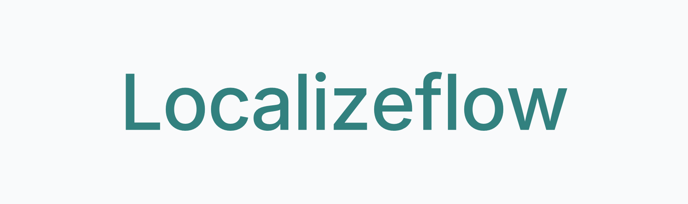
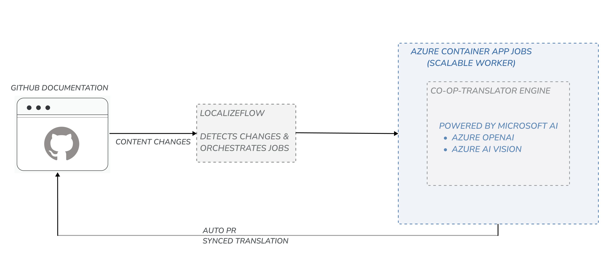

# Localizeflow

Localizeflow is the production layer on top of Co-op Translator,
built for large-scale multilingual documentation.

It runs translation workflows beyond CI limits,
keeps documentation in sync,
and delivers updates through GitHub pull requests.

🌐 https://localizeflow.com

---

## Relationship to Co-op Translator

Localizeflow builds on top of **Co-op Translator**.

Co-op Translator enables translation.

Localizeflow makes it reliable and scalable in production.

It adds:

- distributed workflow orchestration  
- execution beyond CI constraints  
- reliability for large translation workloads  
- GitHub-native PR-based synchronization  

https://github.com/Azure/co-op-translator

---

## How it works

Localizeflow runs as a background automation layer
that keeps translations aligned with source documentation.

1. Detect changes in source documentation  
2. Split translation jobs into distributed workloads  
3. Run workflows beyond CI limits  
4. Open pull requests with updated translations  

Documentation evolves.  
Translations stay in sync.

